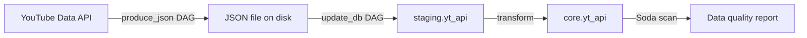

# Airflow YouTube ELT Demo

A containerised Apache Airflow project that extracts YouTube channel video statistics from the YouTube Data API, loads them into PostgreSQL, and performs simple data quality checks with Soda.

## What it does

1. **Extract** (`produce_json` DAG)  
   Calls the YouTube Data API to fetch metadata and statistics for all videos in a channel's uploads playlist, then saves the result as a daily JSON file in `/opt/airflow/data`.

2. **Load & transform** (`update_db` DAG)  
   Reads the daily JSON file and upserts it into a `staging.yt_api` table, then transforms and upserts the data into a `core.yt_api` table.

3. **Data quality checks** (Soda)  
   Validates the `yt_api` table with checks for missing/duplicate video IDs and logical consistency between likes/comments and views.

## Architecture



Services:

- `airflow-webserver` – Airflow UI
- `airflow-scheduler` – DAG scheduling
- `airflow-worker` – Celery task execution
- `postgres` – Airflow metadata + Celery result backend + ELT database
- `redis` – Celery message broker

## Requirements

- **Python** 3.10 (matches the Airflow Docker image)
- **Docker** Engine 24.x or later
- **Docker Compose** v2
- A valid **YouTube Data API v3 key**
- At least **4 GB RAM**, **2 CPUs**, and **10 GB disk** available for Docker

## Project structure

```
.
├── Dockerfile                              # Custom Airflow image
├── docker-compose.yaml                     # Local Airflow + Postgres + Redis stack
├── requirements.txt                        # Python dependencies
├── .env                                    # Environment variables (not committed)
├── docker/postgres/init-multiple-databases.sh  # Creates Airflow metadata, Celery, and ELT DBs
├── airflow/
│   ├── dags/
│   │   ├── main.py                         # DAG definitions
│   │   ├── api/video_stats.py              # YouTube API extraction tasks
│   │   └── datawarehouse/                  # Staging/core loading logic
│   ├── include/soda/
│   │   ├── configuration.yml               # Soda data source configuration
│   │   └── checks.yml                      # Soda data quality checks
│   ├── data/                               # Landing zone for daily JSON files
│   ├── logs/                               # Airflow logs
│   └── tests/                              # Reserved for Airflow/pytest tests
└── README.md
```

## Configuration

Create a `.env` file in the project root with the following variables:

```bash
# YouTube Data API credentials
API_KEY=<your-youtube-api-key>
CHANNEL_HANDLE=<target-youtube-channel-handle>

# Docker image (build/push your own or use a local image)
DOCKERHUB_NAMESPACE=<your-dockerhub-namespace>
DOCKERHUB_REPOSITORY=<your-image-name>
IMAGE_TAG=<image-tag>

# Postgres superuser (also used by init script)
POSTGRES_CONN_USERNAME=postgres
POSTGRES_CONN_PASSWORD=<strong-password>
POSTGRES_CONN_HOST=postgres
POSTGRES_CONN_PORT=5432

# Airflow metadata database
METADATA_DATABASE_NAME=airflow_metadata_db
METADATA_DATABASE_USERNAME=airflow_meta_user
METADATA_DATABASE_PASSWORD=<strong-password>

# Celery result backend database
CELERY_BACKEND_NAME=celery_results_db
CELERY_BACKEND_USERNAME=celery_user
CELERY_BACKEND_PASSWORD=<strong-password>

# ELT target database
ELT_DATABASE_NAME=elt_db
ELT_DATABASE_USERNAME=yt_api_user
ELT_DATABASE_PASSWORD=<strong-password>

# Airflow runtime settings
AIRFLOW_UID=50000
AIRFLOW_WWW_USER_USERNAME=airflow
AIRFLOW_WWW_USER_PASSWORD=<strong-password>
FERNET_KEY=<base64-fernet-key>

# Soda schema to scan (e.g. core or staging)
SCHEMA=core
```

Generate a Fernet key with:

```bash
python -c "from cryptography.fernet import Fernet; print(Fernet.generate_key().decode())"
```

## Build the Docker image

The custom image extends `apache/airflow:2.9.2-python3.10` and installs the packages in `requirements.txt`.

```bash
docker build -t ${DOCKERHUB_NAMESPACE}/${DOCKERHUB_REPOSITORY}:${IMAGE_TAG} .
```

If you only want to run locally, any image tag will work as long as it matches the value in `.env`.

## Deploy the services

1. Start the stack (runs database initialisation, migrations, and creates the admin user):

   ```bash
   docker compose up -d
   ```

2. Wait for all services to become healthy:

   ```bash
   docker compose ps
   ```

3. Open the Airflow UI at [http://localhost:8080](http://localhost:8080) and log in with the credentials from `.env` (`AIRFLOW_WWW_USER_USERNAME` / `AIRFLOW_WWW_USER_PASSWORD`).

4. Unpause the DAGs:

   - `produce_json` – scheduled daily at 14:00 America/New_York
   - `update_db` – scheduled daily at 15:00 America/New_York

   Or trigger them manually from the UI for an initial backfill/test run.

## Running Soda data quality tests

Soda is installed in the Airflow image via `requirements.txt`. Run checks from inside the Airflow container after the `update_db` DAG has populated the target table.

### Test the Soda connection

Run the command from inside a running Airflow container (the scheduler is used here because it is always online):

```bash
docker compose exec airflow-scheduler soda test-connection -d pg_datasource -c /opt/airflow/include/soda/configuration.yml -V
```

The CLI will prompt for your Soda Cloud credentials unless you have already authenticated.

### Run the checks

```bash
docker compose exec airflow-scheduler soda scan -d pg_datasource -c /opt/airflow/include/soda/configuration.yml /opt/airflow/include/soda/checks.yml -V
```

### Check contents

- `airflow/include/soda/configuration.yml` – configures the PostgreSQL data source for Soda.
- `airflow/include/soda/checks.yml` – defines checks for:
  - No missing `Video_ID` values
  - No duplicate `Video_ID` values
  - No rows where `Likes_Count > Video_Views`
  - No rows where `Comments_Count > Video_Views`

## Running Python unit tests

`pytest` is included in `requirements.txt`. To run tests from a running Airflow container:

```bash
docker compose exec airflow-scheduler pytest /opt/airflow/tests -v
```

Add tests to `airflow/tests/` as needed.

## Useful CLI commands

```bash
# View Airflow logs
docker compose logs -f airflow-scheduler

# Open a shell in the Airflow container
docker compose exec airflow-scheduler bash

# List DAGs
docker compose exec airflow-scheduler airflow dags list

# Trigger a DAG manually
docker compose exec airflow-scheduler airflow dags trigger produce_json
docker compose exec airflow-scheduler airflow dags trigger update_db

# Stop all services
docker compose down

# Stop services and remove volumes
docker compose down -v
```

## Notes

- This setup is intended for **local development**. Do not use the default credentials or local configuration in production.
- The `postgres` healthcheck validates the Airflow metadata database; the other two databases are created by `docker/postgres/init-multiple-databases.sh` on first start.
- The DAGs use `Variable.get("API_KEY")` and `Variable.get("CHANNEL_HANDLE")`, which Airflow reads from the `AIRFLOW_VAR_API_KEY` and `AIRFLOW_VAR_CHANNEL_HANDLE` environment variables defined in `.env`.
- The `update_db` DAG reads `YT_data_YYYY-MM-DD.json` from `/opt/airflow/data` based on the current date, so run `produce_json` first (or place a sample file in `airflow/data`).

