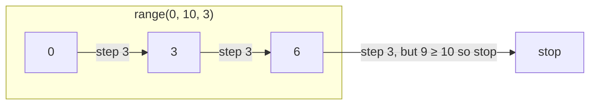

# How `batch_list` Slices a List

## The Code

```python
def batch_list(video_ids: list[str], batch_size):
    for id in range(0, len(video_ids), batch_size):
        yield video_ids[id: id + batch_size]
```

## Example

`video_ids` has **10** items and `batch_size = 3`.

```
Index:    0      1      2      3      4      5      6      7      8      9
         ┌──────┬──────┬──────┬──────┬──────┬──────┬──────┬──────┬──────┬──────┐
List:    │  A   │  B   │  C   │  D   │  E   │  F   │  G   │  H   │  I   │  J   │
         └──────┴──────┴──────┴──────┴──────┴──────┴──────┴──────┴──────┴──────┘
```

## Step 1: `range(0, 10, 3)` generates start indices

The third number (`3`) is the **step**. It jumps 3 positions each time.

```
range(0, 10, 3)  →  0, 3, 6
```



## Step 2: Each index becomes the start of a slice

The slice `video_ids[id : id + 3]` takes **3 items** starting at `id`.

```
Batch 1: id = 0
         0      1      2      3
         ┌──────┬──────┬──────┬──────┐
         │  A   │  B   │  C   │ ...
         └──────┴──────┴──────┴──────┘
         └───────── slice [0:3] ──────┘
         → yields [A, B, C]

Batch 2: id = 3
                3      4      5      6
                ┌──────┬──────┬──────┬──────┐
                │  D   │  E   │  F   │ ...
                └──────┴──────┴──────┴──────┘
                └──────── slice [3:6] ──────┘
                → yields [D, E, F]

Batch 3: id = 6
                       6      7      8      9
                       ┌──────┬──────┬──────┬──────┐
                       │  G   │  H   │  I   │ ...
                       └──────┴──────┴──────┴──────┘
                       └──────── slice [6:9] ──────┘
                       → yields [G, H, I]
```

## Step 3: The last batch may be smaller

There is no `id = 9` because the next step would land at `9`, and the slice `[9:12]` only has one item (`J`).

Wait — actually `range(0, 10, 3)` stops at values < 10, so the next value after `6` would be `9`. Since `9 < 10`, it **is** included.

So the full loop actually runs for `id = 0, 3, 6, 9`:

```
Batch 4: id = 9
                              9
                              ┌──────┐
                              │  J   │
                              └──────┘
                              └slice [9:12]┘
                              → yields [J]
```

## Final Output

| Iteration | `id` from `range` | Slice used | Yielded batch |
|-----------|-------------------|------------|---------------|
| 1 | 0 | `[0:3]` | `[A, B, C]` |
| 2 | 3 | `[3:6]` | `[D, E, F]` |
| 3 | 6 | `[6:9]` | `[G, H, I]` |
| 4 | 9 | `[9:12]` | `[J]` |

## Key Takeaway

- `range(0, len(video_ids), batch_size)` uses `batch_size` as a **step** to find each batch's starting index.
- `video_ids[id : id + batch_size]` uses `batch_size` as the **length** of the slice itself.
- The two `batch_size` usages work together: one jumps the start pointer, the other fixes how many items each batch holds.
